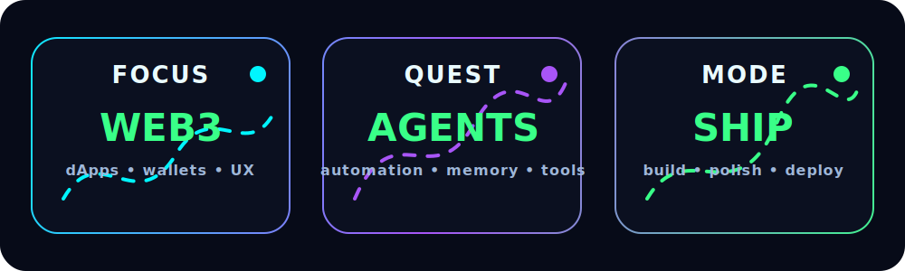
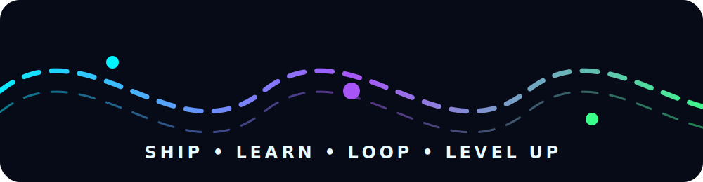

<div align="center">
  

  <br />

  

  <br />

  <a href="https://github.com/nxrskyaa?tab=followers">
    
  </a>
  
  
</div>

<br />

<div align="center">
  <code>web3</code> · <code>ritual chain</code> · <code>autonomous agents</code> · <code>next.js</code> · <code>wagmi</code> · <code>viem</code> · <code>ai x crypto</code>
</div>

<br />

##  Yo, I’m Nxrskyaa

```ts
const nxrskyaa = {
  role: "Web3 + AI Agent Builder",
  vibe: "clean UI, fast experiments, on-chain playgrounds",
  currentlyCooking: ["Tennis Rally Arc", "Ritual Chain dApps", "autonomous agents"],
  favoriteStack: ["Next.js", "TypeScript", "Tailwind", "wagmi", "viem"],
  motto: "ship it, polish it, make it feel alive",
};
```

<br />

## ⚡ Visual Stack

<div align="center">

<table>
<tr>
<td align="center" width="33%">
  <h3>🧠 AI / Agents</h3>
  <br /><br />
  <sub>autonomous flows, tooling, experiments</sub>
</td>
<td align="center" width="33%">
  <h3>⛓️ Web3</h3>
  <br /><br />
  <sub>dApps, smart contracts, wallet UX</sub>
</td>
<td align="center" width="33%">
  <h3>🎨 Frontend</h3>
  <br /><br />
  <sub>polished interfaces that don’t feel boring</sub>
</td>
</tr>
</table>

</div>

<br />

## 🚀 Featured Build

<div align="center">

### 🎾 Tennis Rally Arc

**Arcade tennis rally game on Arc Testnet — playable without wallet, score submit with injected wallet.**

<br />

<a href="https://my-app-smoky-eight-25.vercel.app">
  
</a>
<a href="https://github.com/nxrskyaa/tennis-rally-arc">
  
</a>

<br />
<br />

`Next.js` · `Tailwind` · `wagmi` · `viem` · `Arc Testnet`

</div>

<br />

## 📊 Build Pulse

<div align="center">
  
</div>

<br />

## 🌊 Activity Mood

<div align="center">
  <picture>
    <source media="(prefers-color-scheme: dark)" srcset="https://github-readme-activity-graph.vercel.app/graph?username=nxrskyaa&bg_color=0B1020&color=EAFBFF&line=39FF88&point=00F5FF&area=true&hide_border=true" />
    
  </picture>
</div>

<br />

<div align="center">
  
</div>

<br />

## 🧩 Current Quest Log

<div align="center">

| Quest | Status |
|---|---|
| 🎾 Tennis Rally Arc dApp | `shipping` |
| 🧠 Persistent / autonomous agent ideas | `researching` |
| ⛓️ Ritual Chain experiments | `building` |
| 🎨 Better Web3 UX patterns | `polishing` |

</div>

<br />

## 🛠️ Tools I Like

<div align="center">


<br />
<br />


</div>

<br />

## 🌐 Connect

<div align="center">
  <a href="https://t.me/Nxrskyaa">
    
  </a>
  <a href="https://x.com/Nxrskyaa">
    
  </a>
  <a href="https://github.com/nxrskyaa">
    
  </a>
</div>

<br />

<div align="center">
  <h3>“Make it useful. Make it fast. Make it feel alive.”</h3>
  <sub>built with too much caffeine and just enough chaos ⚡</sub>
</div>
