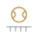

I build things that run entirely in a browser tab: voxel and pixel action RPGs, onchain frontends, and small agent tools. The constraint I keep coming back to is *self-contained* — art generated at runtime instead of shipped as files, audio synthesized instead of streamed, and no backend I can't explain in a paragraph.

## Selected work

| Project | What it is | Stack |
| --- | --- | --- |
|  **[Odyvion](https://github.com/nxrskyaa/Odyvion)** [live ↗](https://odyvion.vercel.app) | 2.5D voxel action RPG in a Homeric Aegean — 7 mythic classes, 14 monsters, 3 world bosses, a papyrus world map. Zero image or audio files. | `three.js` `Vite` `WebAudio` |
|  **[UniskyPass](https://github.com/nxrskyaa/UniskyPass)** [live ↗](https://unisky-pass.vercel.app) | Non-transferable, time-based membership passes on Monad. Check-in is an EIP-712 signature over a rotating QR challenge — no gas, no onchain tx. Monad Spark Hackathon. | `Next.js` `Solidity` `Foundry` `Privy` |
|  **[Anasta Chronicle](https://github.com/nxrskyaa/AnastaChronicle)** [live ↗](https://anasta-chronicle.vercel.app) | Pixel-art 2.5D forest adventure — co-op world bosses, duels, fishing, pets, quests. Vanilla JS, no build step, fully code-generated pixel world. | `Canvas 2D` `vanilla JS` |
|  **[Ritual Agent Feeds](https://github.com/nxrskyaa/ritual-agent-feeds)** [live ↗](https://ritual-agent-feeds.vercel.app) | Agent terminal over an onchain message feed on Ritual Testnet. | `TypeScript` `Ritual` |
|  **[Luvyn Studio](https://github.com/nxrskyaa/LuvynStudio)** [live ↗](https://master-build-prompt-luvyn-studio-di.vercel.app) | Catalog and working demos for digital invitations — editorial stationery look, serif type, restrained motion, guest personalization. | `Next.js` `Tailwind` |
|  **[Tennis Rally Arc](https://github.com/nxrskyaa/tennis-rally-arc)** [live ↗](https://my-app-smoky-eight-25.vercel.app) | Arcade tennis on Arc Testnet — playable without a wallet, optional onchain profile and score submit. | `Next.js` `wagmi` `viem` |

Smaller experiments — [Rialo Temple Agent](https://github.com/nxrskyaa/RialoTempleAgent) · [arcynite](https://github.com/nxrskyaa/arcynite) · [siggy-scroll](https://github.com/nxrskyaa/siggy-scroll) · [NxrLegends](https://github.com/nxrskyaa/NxrLegends) · [rialoball](https://github.com/nxrskyaa/rialoball)

## Odyvion, in more detail

A mythic voxel action RPG in the browser: white-marble Aegean islands, the temple of Athena, the Pharos lighthouse, olive groves, and a wine-dark sea kept lit at night by bronze braziers.

- **Nothing is a file.** Every texture, sprite, icon, building, and even the logo is generated procedurally on a canvas at runtime. The soundtrack is in Greek modes — lyre, aulos, syrinx — and every note and SFX is synthesized through WebAudio.
- **Seven classes** with authentic weapon silhouettes: xiphos and aspis, composite bow, omphalos staff, sickle daggers — three skills each, with skill leveling.
- **A full economy** — crafting, a +1..+9 forge, fishing (manual and AFK), farming, housing, treasure, and cosmetic wardrobe.
- **Renders well** — ACES filmic tone mapping with subtle bloom and soft PCF shadows on desktop; virtual joystick and non-overlapping action buttons on mobile.

## Stack

- **Frontend** — `TypeScript` `React` `Next.js` `Tailwind` `Vite`
- **Graphics & games** — `three.js` `Canvas 2D` `WebAudio` · procedural textures, sprites, and sound synthesis
- **Onchain** — `Solidity` `Foundry` `wagmi` `viem` `Privy` · Monad, Ritual, and Arc testnets

## Currently

- **Odyvion** — multiplayer (WebSocket/WebRTC) and wallet auth are next on the roadmap
- Going deeper on onchain agents: scheduled jobs, precompile-driven inference
- Keeping every project zero-config deployable

## Elsewhere

[x.com/nxrskyaa](https://x.com/Nxrskyaa) · [t.me/Nxrskyaa](https://t.me/Nxrskyaa)

